

  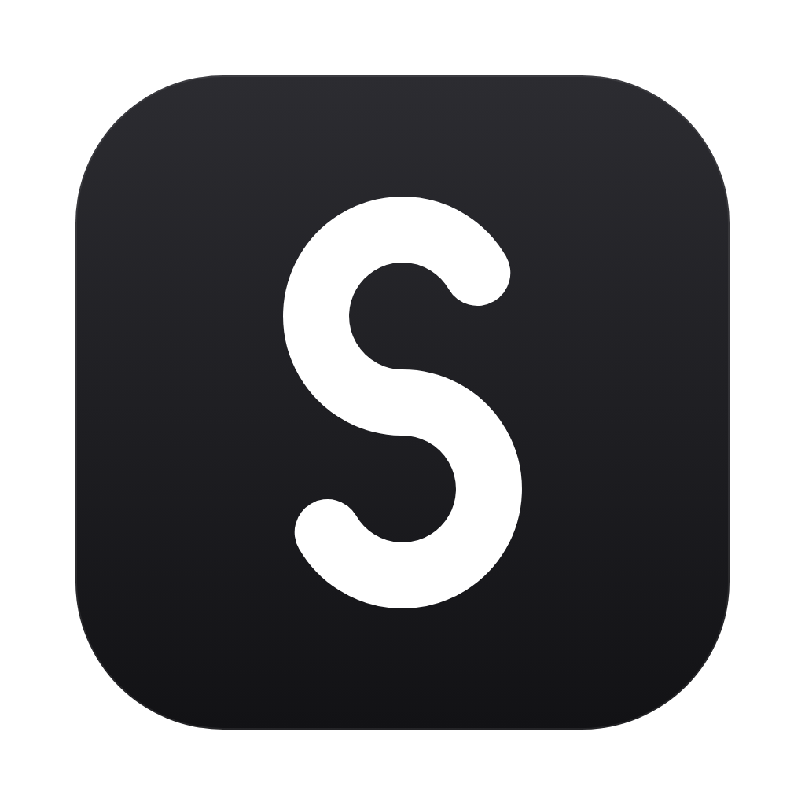

<h1 align="center">Soul</h1>

  Log your days in one place: routines, habits, a journal, the numbers you track, and your money.

  <a href="https://github.com/eduardtomas1/soul/releases/latest"><strong>Download Soul</strong></a>
  ·
  <a href="#getting-soul">How to install</a>
  ·
  <a href="#your-data-is-yours">Your data</a>

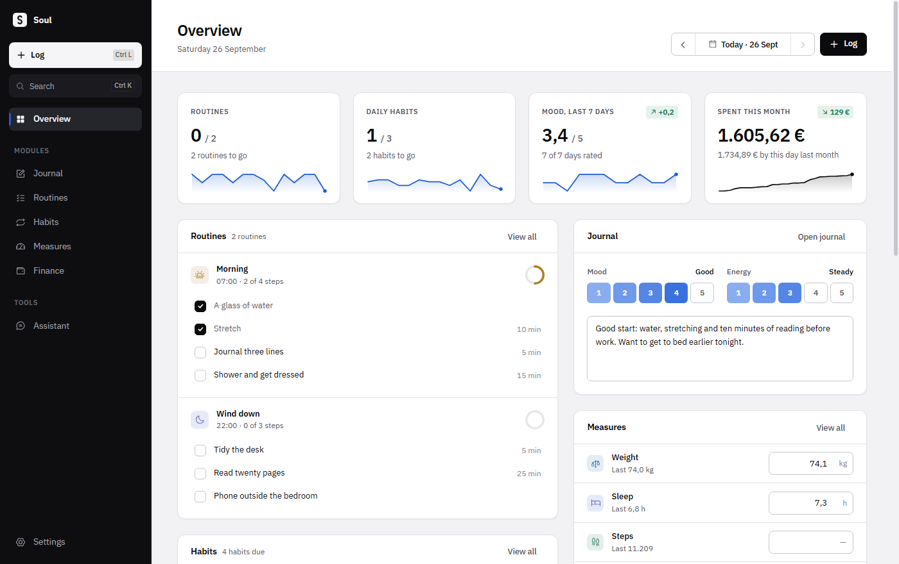

Soul is a free desktop app for one person. It runs on Windows and Linux, keeps everything on your own computer and needs no account. Think of it as a small back office for your own life: clear figures, tidy tables and charts that show how things are going.

## An overview of the day

Open Soul and you see where the day stands: routines and habits done, your mood over the last week and what you have spent this month, each with a small trend line. Below that are today's checklists, your journal, your measures, everything logged so far and the payments coming up. Tick a step, check in a habit or jot down a line right from there.

Forgot to log yesterday? Step back a day, or pick any date, and fill it in exactly as if it were today. The last thirty days are charted too: how consistent you were, what you spent each day, and how your mood and energy moved.

## Log anything in seconds

Press Ctrl+L from anywhere, or the Log button, to open a small window for an expense, income, habits, routine steps, measures or a journal entry, on today or any earlier day. Soul remembers what you usually log. Type "coffee" and the category, account and last amount are filled in, so Enter is often all it takes. Ctrl+Enter logs and leaves the window open for the next one.

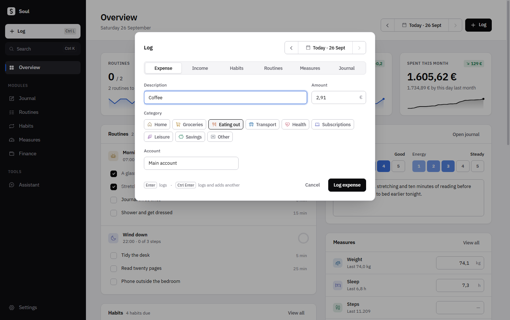

## A journal for every day

Each day gets a page: a note, your mood and your energy on a scale of one to five, and a list of everything else logged that day. That includes routines finished, habits checked in, measures recorded, money in and out, and milestones reached. A month calendar shades each day by mood and shows how much of the day's plan got done. You can search every note you have ever written.

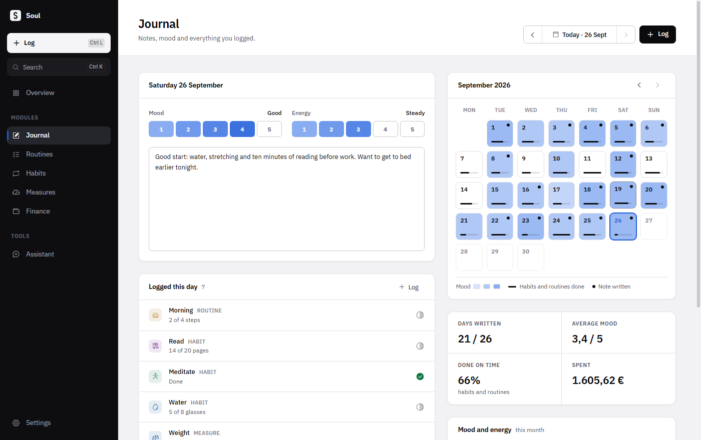

## Measures

Track any number you care about, one value a day: weight, sleep, steps, resting heart rate, or anything else. Give it a unit, a precision, whether higher or lower is better and, if you like, a target. A grid of the last seven days lets you fill in a whole week at once. Each measure has its averages, its change over the month and a chart with the target drawn in. The change shows green when it moves the way you want and red when it doesn't, and the target reads Reached once you get there.

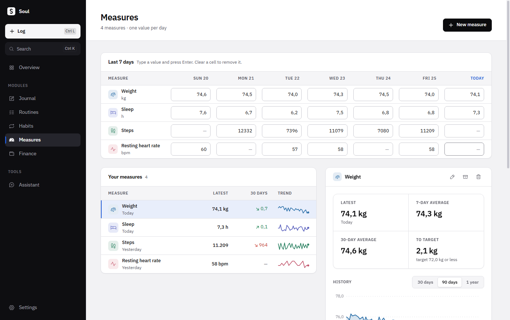

## Routines

A routine is a short checklist tied to a time of day: a morning, a wind-down, a Sunday review. Give it a time and the days it belongs to. Soul shows today's steps and keeps the last two weeks in view, so you can see at a glance how consistent you have been.

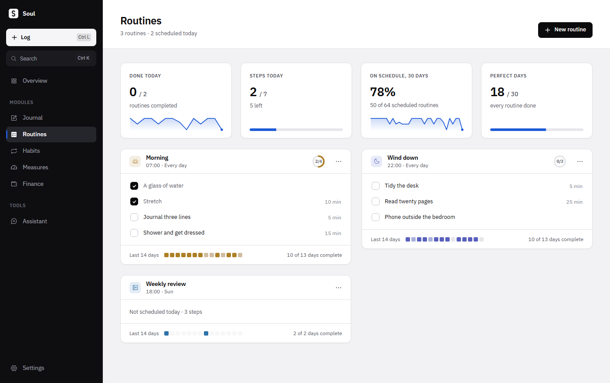

## Habits

Habits are the things you want to keep doing. Some are a simple yes or no. Others are counts: pages, glasses of water, runs. A habit can be daily or weekly, on the days you choose. Each one has a current streak, a best streak, a completion rate and a full year of history.

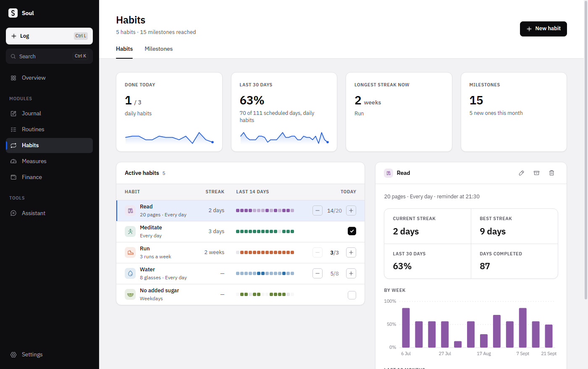

Milestones mark the moments that count: your first check-in, a week without missing, a month, a hundred days, a perfect week across every habit, a savings goal reached.

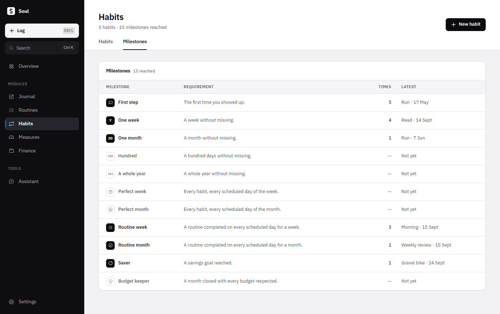

## Finance

Finance in Soul is in euros. Accounts hold your balances. Categories show where the month went. Budgets show how much of each category is left and turn red if you go over. Recurring items like your salary, rent and subscriptions can record themselves on their due date, which lets Soul forecast the next six months.

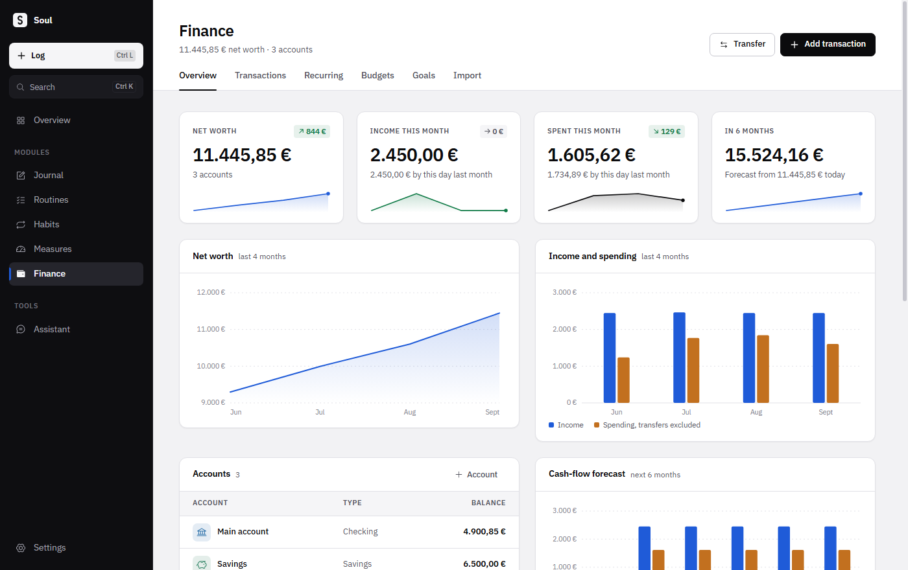

The ledger lists every transaction with its date, category and account. Move money between your accounts with a transfer. You can also bring in a statement downloaded from your bank as a CSV file. Soul works out how the file is laid out, understands European dates and amounts, and skips anything you already have.

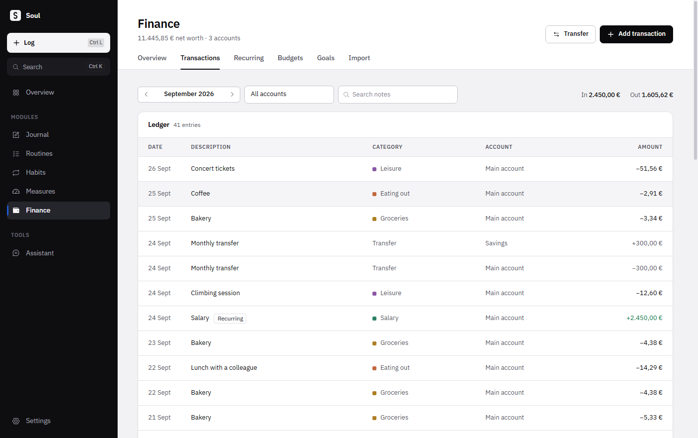

Savings goals track what you set aside for something specific, and show what is left to go.

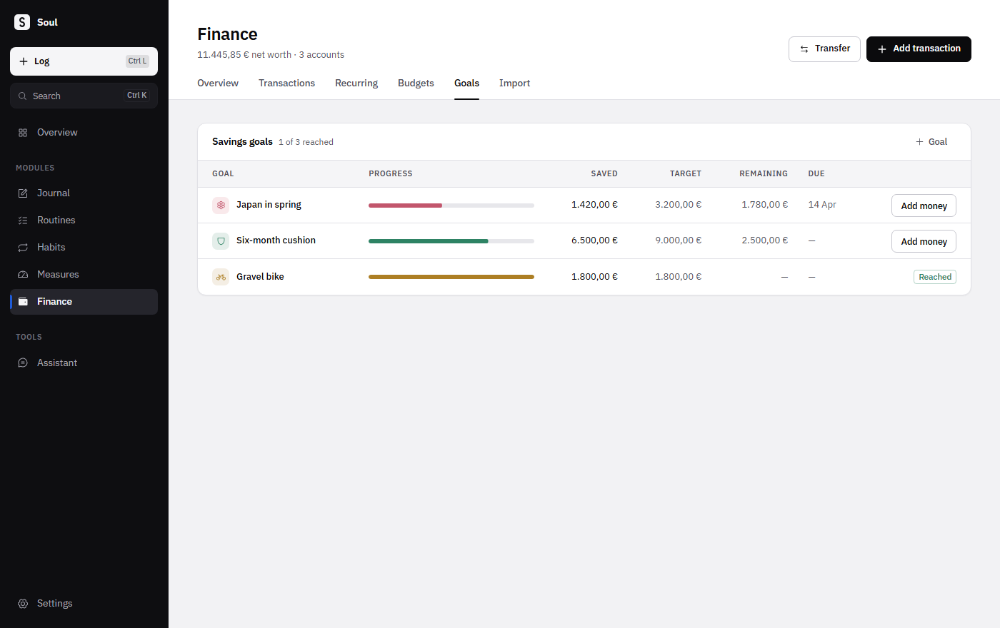

## An assistant that knows your numbers

If you already use Claude Code or Codex on your computer, Soul can talk to it. Ask where the money goes at the weekend, which habit slips most, whether you sleep better on the days you run, or whether you will stay above zero this winter. There are no keys to paste. Soul uses the tool you have already installed and signed in to.

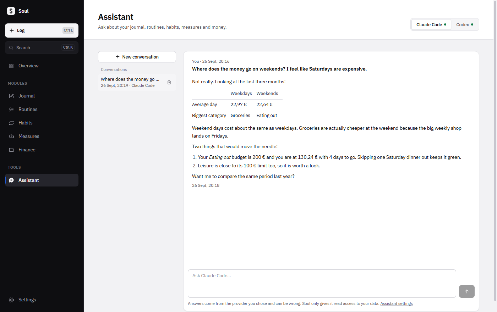

The assistant can read your routines, habits, journal, measures and finances, but it can never change anything. Journal notes are only read when a question needs them. Nothing is sent until you ask a question. When you do, the question and the data needed to answer it go to the company behind the tool you picked, Anthropic for Claude Code or OpenAI for Codex, under your own account. The assistant is optional: if you use neither tool, everything else in Soul works the same.

## Reminders

Give a routine or a habit a reminder time and Soul sends a desktop notification when it is due, unless you have already done it. Reminders arrive while Soul is running, so you can set it to open when you log in to your computer. You can turn them all off in Settings.

## Your data is yours

Everything lives in a single file on your computer. There is no account, no tracking and no advertising. Export a backup whenever you like and restore it on any computer that runs Soul.

If you want a copy somewhere safe, connect your own Google Drive. Soul keeps exactly one backup file there and replaces it each time: only when you ask, once a day, or shortly after you change something. You can protect backups with a passphrase, and then only someone who knows it can open them.

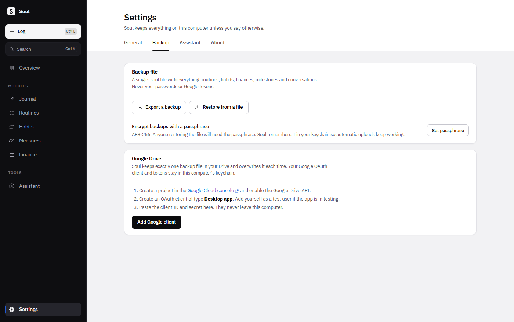

Soul never sees your Google password. You connect Drive through a Google project you create yourself, and the Backup settings walk you through it. Soul only asks Google for permission to manage the files Soul itself created. The connection details and your passphrase are protected by your computer's keychain and are never included in a backup.

## Light, dark or slate

Soul follows your system's appearance, or you choose. Besides light and dark there is a slate theme: icy-blue pages, a dusk-blue sidebar and sky-blue highlights, calm on the eyes. Numbers count up, charts draw in and panels slide into place. If you prefer a still screen, turn motion off in Settings. Soul also follows your system's reduced-motion setting.

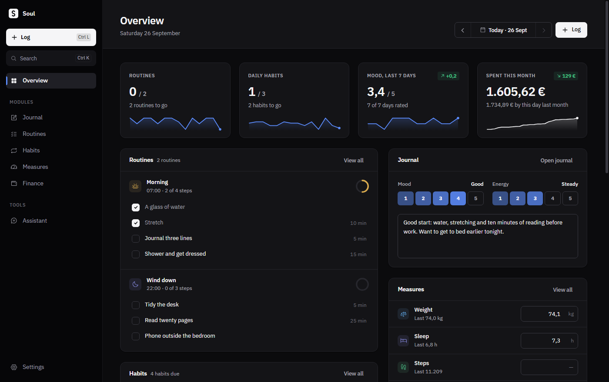

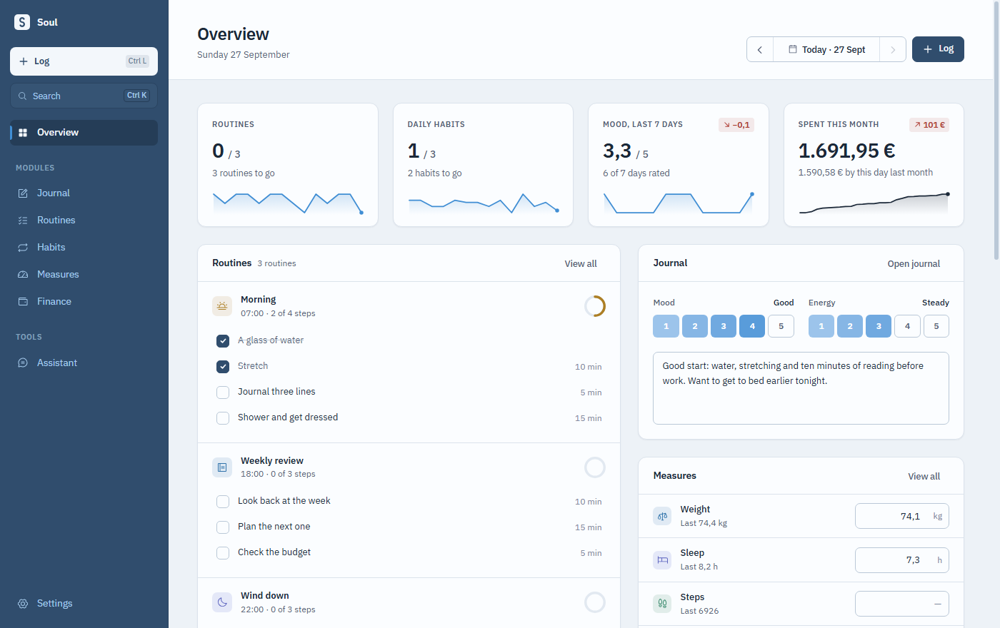

## Getting Soul

Download Soul from [Releases](https://github.com/eduardtomas1/soul/releases/latest) and pick the file for your computer:

| Your computer | File |
| --- | --- |
| Windows PC | `win-x64.exe` |
| Windows on ARM (for example a Surface Pro X or a Snapdragon laptop) | `win-arm64.exe` |
| Linux | `linux-x86_64.AppImage`, or `linux-arm64.AppImage` on ARM |

- **Windows:** run the installer.
- **Linux:** make the AppImage executable and open it.

This first version is for Windows and Linux. It is not signed for Windows yet, so the first launch shows a warning: choose More info, then Run anyway. The [installation notes](docs/release-notes.md) explain this in more detail, help when the AppImage doesn't start, and show how to check that your download is genuine.

## Good to know

- Soul is made for one person on one computer. To move to a new computer, export a backup and restore it there, or restore it from Google Drive.
- Amounts are in euros and the app is in English.
- Soul doesn't update itself yet. New versions appear on [Releases](https://github.com/eduardtomas1/soul/releases), and installing one keeps your data.

## Thanks

Icons are by [Phosphor](https://phosphoricons.com). The typeface is [IBM Plex Sans](https://github.com/IBM/plex), used under the SIL Open Font License.

Soul is released under the [Apache 2.0](LICENSE) license. If you want to build it yourself, [AGENTS.md](AGENTS.md) describes how the project is put together.
